# Assemblr Self-Healing Runtime: Deliverables

## 1. Recovery Flow Diagram

```mermaid
sequenceDiagram
    participant UI as User Interface
    participant Runtime as MiniAppRuntime
    participant Integration as Integration Layer
    participant Recovery as Recovery Engine (AI)

    UI->>Runtime: Dispatch Action (e.g., fetch_emails)
    Runtime->>Runtime: Set Status: "loading"
    Runtime->>Integration: Execute Action
    
    alt Success
        Integration-->>Runtime: Return Data
        Runtime->>UI: Update Data, Status: "success"
    else Failure (e.g., Invalid Params, Auth Error)
        Integration-->>Runtime: Return Error
        
        rect rgb(255, 230, 230)
            note right of Runtime: 🚨 SELF-HEALING TRIGGERED
            Runtime->>Runtime: Set Status: "recovering" (UI shows "Attempting self-healing...")
            Runtime->>Recovery: recoverExecution(actionId, error, currentSpec)
            
            Recovery->>Recovery: 1. Analyze Failure Context
            Recovery->>Recovery: 2. Re-compile Intent with "Repair" Mode
            Recovery->>Recovery: 3. Materialize New Spec
            
            alt Recovery Success
                Recovery-->>Runtime: New Spec + Explanation
                Runtime->>Runtime: updateSpec(newSpec) (Hot Reload)
                Runtime->>Runtime: Retry Action (with new config)
                Runtime->>Integration: Execute Action (Retry)
                Integration-->>Runtime: Return Data
                Runtime->>UI: Update Data, Status: "success"
            else Recovery Failed
                Recovery-->>Runtime: Cannot fix
                Runtime->>UI: Show Error + Explanation
            end
        end
    end
```

## 2. Failure Classes & Handling Strategies

| Failure Class | Example Error | Handling Strategy |
| :--- | :--- | :--- |
| **Action Not Found** | `Action 'gmail_list' not found` | **Capability Discovery**: Planner searches available capabilities for a match (e.g., `google_gmail_list`) and updates the action ID. |
| **Capability Mismatch** | `Method 'list' not supported` | **Alternative Selection**: Planner selects a different capability or method that achieves the same goal. |
| **Invalid Parameters** | `Missing required param: 'query'` | **Param Adjustment**: Planner infers missing parameter from context/history or sets a safe default. |
| **Auth/Permission** | `403 Forbidden` / `Scope missing` | **Scope Check**: Planner identifies missing scope and prompts user (or falls back to public data if applicable). *Note: Full auth flow requires user intervention, but runtime handles the graceful degradation.* |
| **Empty Data** | `Returned 0 rows` (Unexpected) | **Query Broadening**: Planner relaxes filter conditions (e.g., remove date filter) and retries. |
| **Ambiguity** | `Multiple tools match 'drive'` | **Disambiguation**: Planner uses "Discovery Hint" to pick the highest-ranked tool based on context. |

## 3. Example Recovery Trace (Gmail)

**User Intent**: "Show my emails"
**Initial Spec**: `{ action: "gmail_fetch", params: { filter: "important" } }`

1.  **Execution**: `Runtime` calls `gmail_fetch`.
2.  **Failure**: Integration returns `Error: Invalid filter 'important'. Allowed: 'INBOX', 'SENT'.`
3.  **Recovery Trigger**:
    *   Runtime captures error.
    *   UI displays: *"Failed: Invalid filter. Attempting self-healing..."*
    *   Calls `recoverExecution`.
4.  **AI Analysis**:
    *   Input: `Error: Invalid filter 'important'`
    *   Knowledge: `google_gmail_list` capabilities.
    *   Decision: Change param `filter` to `INBOX` (closest valid default).
5.  **Patch**:
    *   New Spec: `{ action: "gmail_fetch", params: { filter: "INBOX" } }`
6.  **Retry**:
    *   Runtime updates spec.
    *   Re-runs `gmail_fetch` with `filter="INBOX"`.
7.  **Success**: Emails returned. UI updates.

## 4. UI Interactivity Proof

The `MiniAppRuntime` ensures the UI never freezes by using a non-blocking state machine:

*   **State Transitions**:
    1.  `idle` -> `loading` (User clicks)
    2.  `loading` -> `recovering` (On error) -> **UI remains interactive** (User can navigate away or cancel).
    3.  `recovering` -> `success` (On fix) OR `error` (If fix fails).
*   **Visual Feedback**:
    *   When status is `recovering`, the UI displays a specific message (e.g., spinner with "Self-healing...").
    *   The `MiniAppHealthPanel` shows the trace: `⚡ Action -> ❌ Error -> 🔄 Recovery -> ✅ Success`.
*   **Verification**: Tested via `verify-runtime-recovery.ts` script (see output below), confirming state transitions occur without throwing unhandled exceptions.

## 5. Generalization to Future Integrations

This architecture is **integration-agnostic**:

1.  **Discovery Engine**: Uses dynamic string matching and heuristics (`lib/ai/discovery.ts`) rather than hardcoded `if/else` maps. Adding a new integration (e.g., "Asana") immediately makes it discoverable if it exposes standard capabilities.
2.  **Standardized Error Contract**: As long as integrations return a string error, the `Recovery Engine` can feed it to the LLM. The LLM uses the error text + Capability Registry to deduce the fix.
3.  **Unified Planner**: The `Planner` context injection (`lib/ai/planner.ts`) ensures the AI always sees the *current* set of tools and their schemas, so recovery logic adapts automatically when new tools are added.
